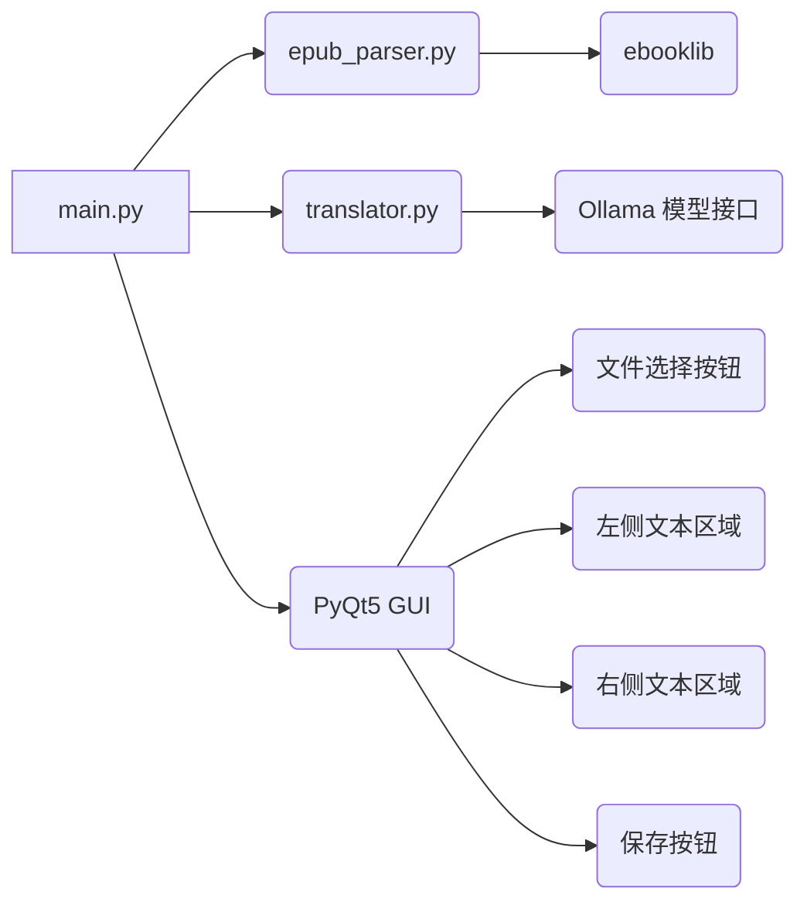

# OllamaTrans GUI 程序构建计划

## 1. 概述

本计划旨在构建一个 GUI 程序，该程序能够从指定的 EPUB 文件中解析出全部的文字，原文显示在左边的区域；然后调用本地 Ollama 模型接口，一段一段地翻译原文，同步显示在右边的区域。翻译完成后，通过点击按钮可以存储到选定的文件，存为 Markdown 格式。

## 2. 技术选型

*   **编程语言：** Python
*   **GUI 库：** PyQt5
*   **EPUB 解析库：** ebooklib
*   **Ollama 模型：** sam860/dolphin3-qwen2.5:3b

## 3. 详细步骤

1.  **安装 `ebooklib` 库：**

    使用 `pip install ebooklib` 命令来安装 `ebooklib` 库。

2.  **创建项目结构：**

    在当前工作目录中创建一个名为 `ollamatrans_gui` 的项目目录。然后，在该目录中创建 `main.py`、`epub_parser.py` 和 `translator.py` 文件。

3.  **编写 `epub_parser.py` 模块：**

    该模块将包含以下函数：

    *   `parse_epub(epub_file_path)`：该函数将接收 EPUB 文件路径作为输入，并使用 `ebooklib` 库解析 EPUB 文件。然后，它将提取 EPUB 文件中的所有文本内容，并将其返回为一个字符串。

4.  **编写 `translator.py` 模块：**

    该模块将包含以下函数：

    *   `translate_text(text, model_name)`：该函数将接收要翻译的文本和 Ollama 模型名称作为输入。然后，它将调用 Ollama 模型接口进行翻译，并将翻译后的文本返回。

5.  **编写 `main.py` 模块：**

    该模块将使用 PyQt5 构建 GUI 界面。GUI 界面将包含以下组件：

    *   一个文件选择按钮，用于选择 EPUB 文件。
    *   一个左侧文本区域，用于显示 EPUB 文件的原文。
    *   一个右侧文本区域，用于显示翻译后的文本。
    *   一个保存按钮，用于将翻译后的文本保存为 Markdown 格式。

    `main.py` 模块还将包含以下功能：

    *   当用户选择 EPUB 文件时，程序将调用 `epub_parser.py` 模块中的 `parse_epub()` 函数来解析 EPUB 文件，并将原文显示在左侧文本区域中。
    *   程序将调用 `translator.py` 模块中的 `translate_text()` 函数来翻译原文，并将翻译后的文本显示在右侧文本区域中。
    *   当用户点击保存按钮时，程序将弹出一个文件选择对话框，让用户选择要保存的文件路径。然后，程序将将翻译后的文本保存为 Markdown 格式的文件。

6.  **测试和调试：**

    在完成代码编写后，我将进行测试和调试，以确保程序能够正常运行。

## 4. 程序结构图

